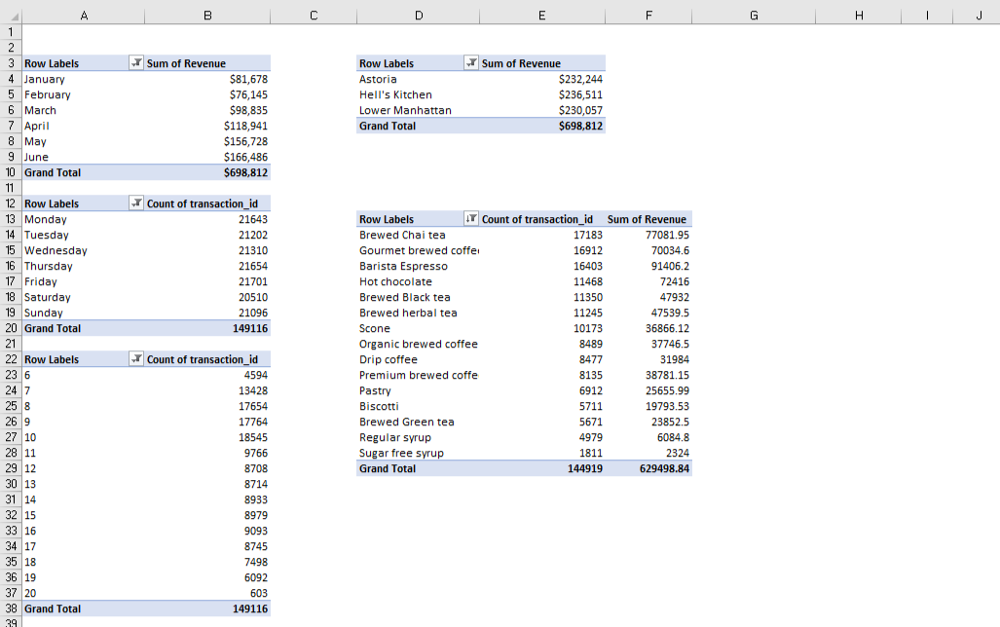

# Coffee-Shop-Sales-
A performance transaction record of a fictitious coffee shop operating out of three NYC locations.

## Data Source
Dataset from _**MAVEN ANALYTICS**_, Imported into _**EXCEL**_ for analysis containing a single table of _**149,116**_ records and 11 fields of data structure.

## Introduction 
This report analyzes the coffee shop sales performance, The dashboard includes insights on total revenue, Total transaction quantity, sales trends over time, peak transaction periods, and product performance. The data is sectioned by location, product category, and sales distribution across different days and times.

## Problem Statement
1: How have Maven Roasters sales trended over time?

2: Which days of the week tend is the busiest, and why do you think that's the case?

3: Which products are sold most and least often? Which drive the most revenue for the business?

## Concept Execution
- Data sources,
- Data cleaning,
- Filters,
- Calculated columns,
- Pivot table,
- Data visualization,
- Dashboard building and
- Reporting.

## Data Cleaning

Added the filter option to my header rows to familarize with the data, search for duplicates and empty rows, column data type were appropriately validated such as the price column to display curency. Added Revenue column by multiplying the ``unit_price*quantity`` , Added a new column to extract the month and weekdays from the transaction date, using ``=TEXT(B2,"mmmm")`` for month and ``=TEXT(B2,"dddd")`` for weekdays and finally added a new column to extract the hour from the transaction time, using ``=HOUR(C2)``

## Pivot Table
Derived data relationships by Comparing data, Aggregating values and summarizing data to ensure interaction and tackling of the problem statement.

## Data Discovery
1. **Sales Performance Over Time:**

   Revenue has shown a positive trend, increasing from $81,678 in January to $166,486 in June, indicating steady business growth.
February experienced a slight dip in revenue ($76,145), but sales rebounded in March and continued to rise, This upward trend indicates successful marketing strategies, demands, or increased customer engagement over time.

2: **Which days of the week tend to be busiest, and why do you think that's the case?**

_Transactions by Hour_:
    The busiest hours for transactions are 7 AM to 10 AM, peak around 10 AM, indicating that morning coffee rush is a significant sales driver, Transactions decrease after 11 AM, with another minor peak around 1-5 PM, likely driven by afternoon coffee breaks.

_Transactions by Weekdays_;
   Sales tend to be highest on business days with Mondays, Thursday, and Friday on top respectively, varies across locations but still maintained the high demands on business days compared to weekends, This could be because business days see increased coffee purchases as people start their workday, while Saturdays and Sundays are popular for social outings, weekend relaxation or shorter operating day.

However, Hells kitchen location had a relatively high demands on Sundays.

3: **Which products are sold most and least often and Which drive the most revenue for the business?**

- _Most sold products_: 
      Coffee and tea categories lead respectively, particularly brewed chai tea, gourmet brewed coffee, and barista espresso.
- _Least sold products_: 
    Packaged chocolate and branded items have the lowest transaction counts.
- _Revenue drivers_: 
   The top revenue-generating products are brewed chai tea, barista espresso, and gourmet brewed coffee. These beverages are high in demand and contribute significantly to overall sales.

## Visualization 
_This report provided an indepth analysis of the coffee shop sales performance with Revenue Distribution by Location_:

Astoria: $230,057 (33%)

Hell’s Kitchen: $232,244 (33%)

Lower Manhattan: $236,511 (34%)

While all locations perform similarly, Lower Manhattan has a slight lead in revenue generation.

## Dashboard

## Recommendation
1: Optimize Peak Hour Sales (7AM - 10 AM):
  Implement a fast-track service for simple coffee or tea orders to reduce wait times and encourage Pre-Order Discounts, Encourage customers to order ahead via an app or website with small discounts to help save time and wait.

2: Boost Afternoon and Evening Sales:
   Introduce discounted coffee or tea from 2 PM - 5 PM to attract more customers and improve Work & Study Spaces, Promote free Wi-Fi and comfortable seating to attract remote workers and students.

3: Increase Sunday Sales:
Family Discounts: Offer family-friendly combo promotions.
